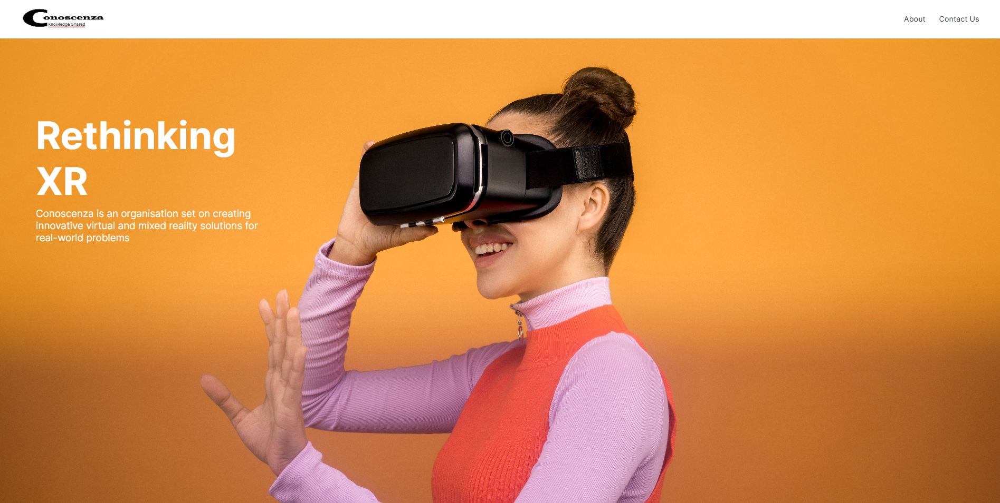

<h1 align="center">Example Websites</h1>

  <b>Websites made with pizazz.</b>

## ✨ Features

- Simple website created with vanilla html and css

## 📋 To-do List

- Use bootstrap
- Use tailwind CSS
- Use sass
- Use vue

## 📜 Credits

Everything is coded by Alex lo Storto

Licensed under the MIT License.
